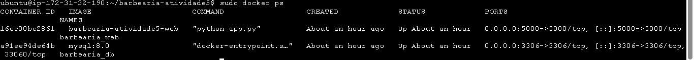
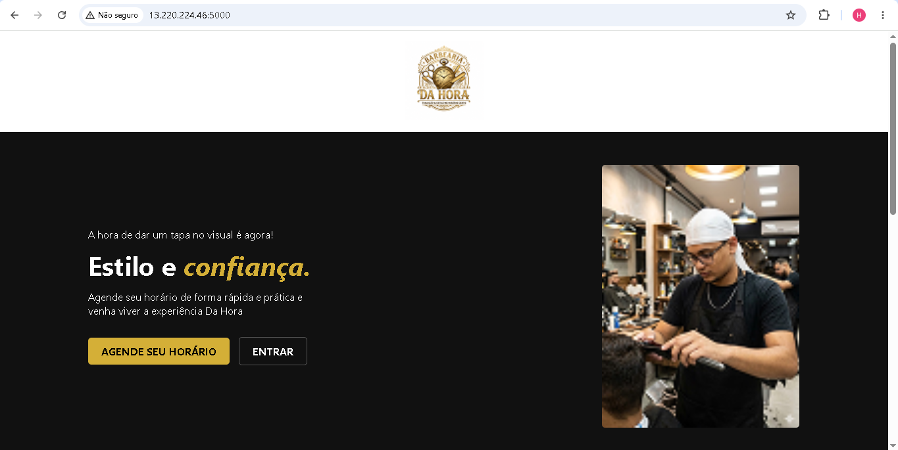

# Projeto Barbearia - Atividade 5

Sistema de agendamentos web desenvolvido com Flask e MySQL, focado em conteinerização com Docker para facilitar o deploy e a escalabilidade.

## 🛠️ Tecnologias Utilizadas
* **Backend:** Python (Flask)
* **Banco de Dados:** MySQL
* **Infraestrutura:** Docker & Docker Compose
* **Cloud:** AWS EC2

## 🐳 Docker Hub (Imagem do Projeto)
A imagem do projeto está publicada e disponível no Docker Hub:
[heitorhora/barbearia-web](https://hub.docker.com/r/heitorhora/barbearia-web)

## 🚀 Como rodar o projeto

### Pré-requisitos
* Ter o **Docker** e **Docker Compose** instalados na sua máquina.

### Passos para execução
1. **Clone o repositório:**
```bash
git clone https://github.com/heitorhora/barbearia-atividade5.git
cd barbearia-atividade5

## 📸 Prints das Telas

* **Containers ativos:**
    

* **Aplicação rodando:**
    